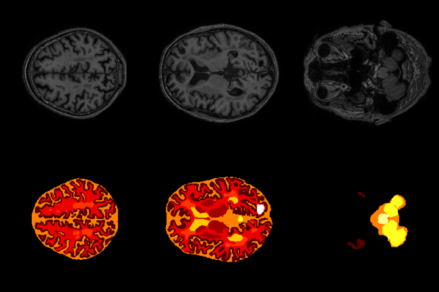
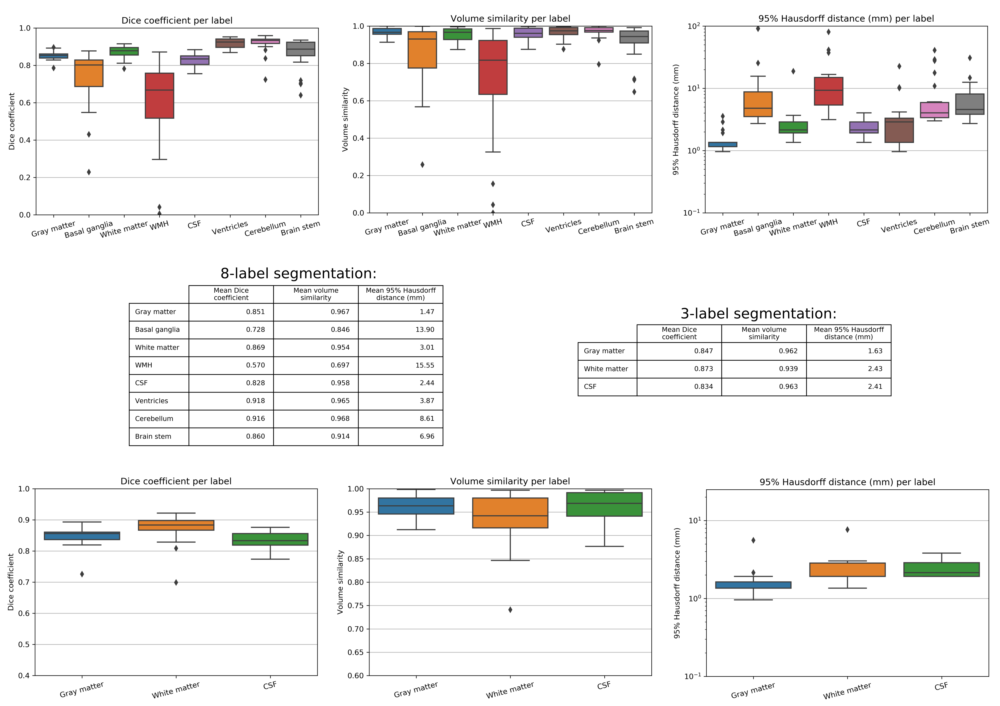

# MRBrainS2018-Brain-Segmentation

MixNet: Multi-modality Mix Network for Brain Segmentation

@inproceedings{LongMACCAIBrainLes,  
&nbsp;&nbsp; author = {Long Chen, Dorit Merhof},  
&nbsp;&nbsp; title = {MixNet: Multi-modality Mix Network for Brain Segmentation},  
&nbsp;&nbsp; booktitle = {MICCAI Brainlesion Workshop (BrainLes)},  
&nbsp;&nbsp; year = {2018},  
}  

## links:
[MICCAI BrainLes Workshop](http://www.brainlesion-workshop.org/)  
[MICCAI MRBrainS2018 Challenge](http://mrbrains18.isi.uu.nl/)  
[MICCAI MRBrainS2013 Challenge](http://mrbrains13.isi.uu.nl/)  
[Institute of Imaging & Computer Vision, RWTH Aachen University](https://www.lfb.rwth-aachen.de/en/)  

# Prerequisites 

## Python dependencies:

- tensorflow
- matplotlib
- scipy
- nibabel

## Data dependencies:

The model is trained with MICCAI [MRBrainS2013](http://mrbrains13.isi.uu.nl/)/[MRBrainS2018](http://mrbrains18.isi.uu.nl/) dataset. To train a model from scratch, you may also use these two datasets.  

If you want to run the code directly, you should organise the dataset structure as following:

For the MICCAI [MRBrainS2013](http://mrbrains13.isi.uu.nl/) dataset:  

├─ root  
&nbsp;&nbsp;&nbsp;&nbsp;└─ MRBrainS2013  
&nbsp;&nbsp;&nbsp;&nbsp;&nbsp;&nbsp;&nbsp;&nbsp;└─ trainingData  
&nbsp;&nbsp;&nbsp;&nbsp;&nbsp;&nbsp;&nbsp;&nbsp;&nbsp;&nbsp;&nbsp;&nbsp;└─ 1  
&nbsp;&nbsp;&nbsp;&nbsp;&nbsp;&nbsp;&nbsp;&nbsp;&nbsp;&nbsp;&nbsp;&nbsp;&nbsp;&nbsp;&nbsp;&nbsp;└─ (LabelsForTesting.nii, LabelsForTraining.nii, T1.nii, T1_1mm.nii, T1_IR.nii, T2_FLAIR.nii)  
&nbsp;&nbsp;&nbsp;&nbsp;&nbsp;&nbsp;&nbsp;&nbsp;&nbsp;&nbsp;&nbsp;&nbsp;└─ 2  
&nbsp;&nbsp;&nbsp;&nbsp;&nbsp;&nbsp;&nbsp;&nbsp;&nbsp;&nbsp;&nbsp;&nbsp;&nbsp;&nbsp;&nbsp;... ...  
&nbsp;&nbsp;&nbsp;&nbsp;&nbsp;&nbsp;&nbsp;&nbsp;└─ testData  
&nbsp;&nbsp;&nbsp;&nbsp;&nbsp;&nbsp;&nbsp;&nbsp;&nbsp;&nbsp;&nbsp;&nbsp;└─ 1   
&nbsp;&nbsp;&nbsp;&nbsp;&nbsp;&nbsp;&nbsp;&nbsp;&nbsp;&nbsp;&nbsp;&nbsp;&nbsp;&nbsp;&nbsp;&nbsp;└─ (T1.nii, T1_1mm.nii, T1_IR.nii, T2_FLAIR.nii)  
&nbsp;&nbsp;&nbsp;&nbsp;&nbsp;&nbsp;&nbsp;&nbsp;&nbsp;&nbsp;&nbsp;&nbsp;└─ 2  
&nbsp;&nbsp;&nbsp;&nbsp;&nbsp;&nbsp;&nbsp;&nbsp;&nbsp;&nbsp;&nbsp;&nbsp;&nbsp;&nbsp;&nbsp;... ...  

For the MICCAI [MRBrainS2018](http://mrbrains18.isi.uu.nl/) dataset:  

├─ root    
&nbsp;&nbsp;&nbsp;&nbsp;└─ MRBrainS2018  
&nbsp;&nbsp;&nbsp;&nbsp;&nbsp;&nbsp;&nbsp;&nbsp;└─ trainingData  
&nbsp;&nbsp;&nbsp;&nbsp;&nbsp;&nbsp;&nbsp;&nbsp;&nbsp;&nbsp;&nbsp;&nbsp;└─ 1  
&nbsp;&nbsp;&nbsp;&nbsp;&nbsp;&nbsp;&nbsp;&nbsp;&nbsp;&nbsp;&nbsp;&nbsp;&nbsp;&nbsp;&nbsp;&nbsp;└─ segm.nii.gz  
&nbsp;&nbsp;&nbsp;&nbsp;&nbsp;&nbsp;&nbsp;&nbsp;&nbsp;&nbsp;&nbsp;&nbsp;&nbsp;&nbsp;&nbsp;&nbsp;└─ pre  
&nbsp;&nbsp;&nbsp;&nbsp;&nbsp;&nbsp;&nbsp;&nbsp;&nbsp;&nbsp;&nbsp;&nbsp;&nbsp;&nbsp;&nbsp;&nbsp;&nbsp;&nbsp;&nbsp;&nbsp;└─ (FLAIR.nii.gz, IR.nii.gz, reg_IR.nii.gz, reg_T1.nii.gz, T1.nii.gz)  
&nbsp;&nbsp;&nbsp;&nbsp;&nbsp;&nbsp;&nbsp;&nbsp;&nbsp;&nbsp;&nbsp;&nbsp;&nbsp;&nbsp;&nbsp;&nbsp;└─ orig  
&nbsp;&nbsp;&nbsp;&nbsp;&nbsp;&nbsp;&nbsp;&nbsp;&nbsp;&nbsp;&nbsp;&nbsp;&nbsp;&nbsp;&nbsp;&nbsp;&nbsp;&nbsp;&nbsp;&nbsp;└─ (FLAIR.nii.gz, IR.nii.gz, reg_3DT1_to_FLAIR.txt, reg_IR.nii.gz, reg_T1.nii.gz, T1.nii.gz, T1_mask.nii.gz)   
&nbsp;&nbsp;&nbsp;&nbsp;&nbsp;&nbsp;&nbsp;&nbsp;&nbsp;&nbsp;&nbsp;&nbsp;└─ 4   
&nbsp;&nbsp;&nbsp;&nbsp;&nbsp;&nbsp;&nbsp;&nbsp;&nbsp;&nbsp;&nbsp;&nbsp;&nbsp;&nbsp;&nbsp;... ...  


## Download pretrainde model

Download the pretrained model [here](http://www.google.com) and put it under the model folder, like:

├─ root    
&nbsp;&nbsp;&nbsp;&nbsp;└─ models  
&nbsp;&nbsp;&nbsp;&nbsp;&nbsp;&nbsp;&nbsp;&nbsp;└─ model_2013_nopp  
&nbsp;&nbsp;&nbsp;&nbsp;&nbsp;&nbsp;&nbsp;&nbsp;&nbsp;&nbsp;&nbsp;&nbsp;&nbsp;&nbsp;&nbsp;&nbsp;└─ checkpoint  
&nbsp;&nbsp;&nbsp;&nbsp;&nbsp;&nbsp;&nbsp;&nbsp;&nbsp;&nbsp;&nbsp;&nbsp;&nbsp;&nbsp;&nbsp;&nbsp;└─ graph.pbtxt  
&nbsp;&nbsp;&nbsp;&nbsp;&nbsp;&nbsp;&nbsp;&nbsp;&nbsp;&nbsp;&nbsp;&nbsp;&nbsp;&nbsp;&nbsp;&nbsp;└─ model.ckpt-257945.data-00000-of-00001  
&nbsp;&nbsp;&nbsp;&nbsp;&nbsp;&nbsp;&nbsp;&nbsp;&nbsp;&nbsp;&nbsp;&nbsp;&nbsp;&nbsp;&nbsp;&nbsp;└─ model.ckpt-257945.index  
&nbsp;&nbsp;&nbsp;&nbsp;&nbsp;&nbsp;&nbsp;&nbsp;&nbsp;&nbsp;&nbsp;&nbsp;&nbsp;&nbsp;&nbsp;&nbsp;└─ model.ckpt-257945.meta  

If the data is not organised as above, you should change the dictionary ```dataset_config``` in ```train.py``` and ```predict.py``` correspondingly.


# Test pre-trainded model

If you have organised the model and dataset as above, you should be able to run directly:

``` python predict.py ```

In ```predict.py```, three python dictionaries are used to config the run:
- net_config: network parameters
- running_config: model location, batch_size
- dataset_config: data locations, input modalities

# Train your own model

To train your own model, run:
``` python train.py```

Similar to the prediction code, ```train.py``` has three python dictionaries to control the network structure and training:
- net_config: network parameters
- training_config: training configurations
- dataset_config: data locations, input modalities

# Results

## Quanlitative resluts



## Quantitative results on MICCAI MRBrianS2018 Dataset



